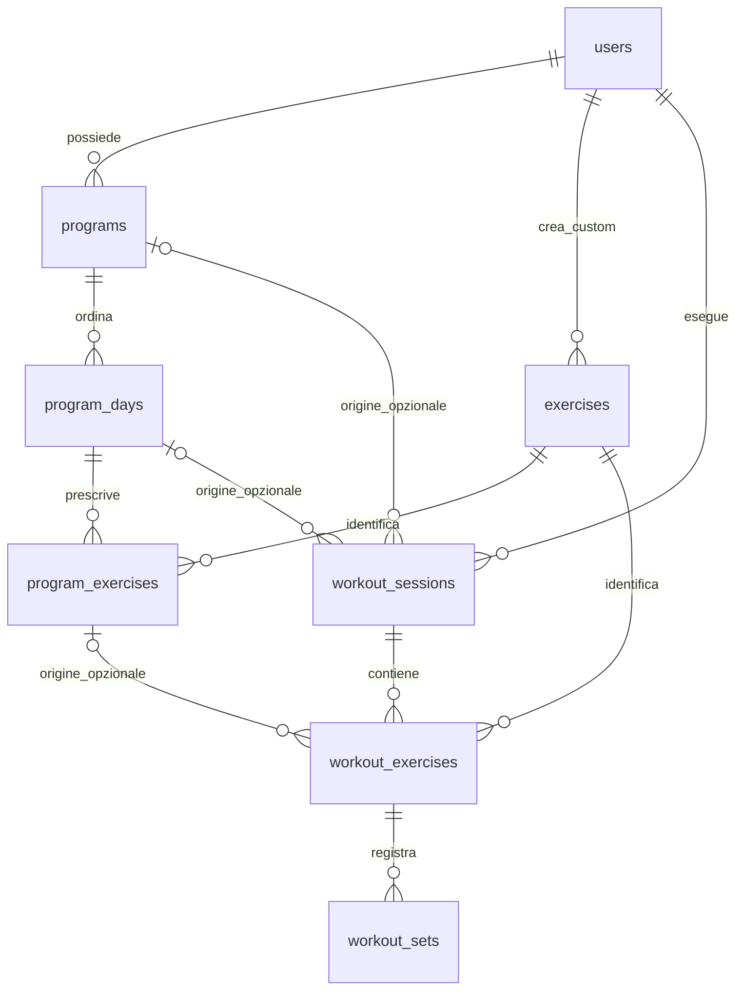

# Database JIMO — Task 3

JIMO usa il progetto Neon indicato dal secret `DATABASE_URL`. Il runtime Fastify e i comandi database usano `@neondatabase/serverless` e `drizzle-orm/neon-http`: HTTPS sulla porta 443, senza pool TCP. Nel cloud Codex la porta PostgreSQL 5432 non è disponibile; questo non blocca il runtime o le migration HTTP.

## Struttura



| Tabella             | Responsabilità                                                                                    |
| ------------------- | ------------------------------------------------------------------------------------------------- |
| `users`             | Identità applicativa stabile, display name facoltativo, locale e unità. Nessuna credenziale auth. |
| `exercises`         | Identità tecnica dell'esercizio, globale oppure custom con proprietario.                          |
| `programs`          | Programma di un utente, stato, durata e data iniziale facoltativi.                                |
| `program_days`      | Giorni ordinati per `position`, senza obbligo di calendario settimanale.                          |
| `program_exercises` | Prescrizioni: numero di set, target, modalità di carico, riposo e note.                           |
| `workout_sessions`  | Allenamenti effettivi, anche liberi, con riferimenti opzionali al programma.                      |
| `workout_exercises` | Identità, nome, modalità e riposo copiati al momento della sessione.                              |
| `workout_sets`      | Target snapshot e risultati actual distinti per ciascun set.                                      |

Tutte le otto tabelle hanno UUID generati da PostgreSQL con `gen_random_uuid()`, `created_at` e `updated_at` di tipo `timestamptz`. Un trigger versionato aggiorna `updated_at` anche per SQL diretto; Drizzle mantiene inoltre il proprio callback di update. Le date TypeScript sono `Date`; una futura API dovrà serializzarle come ISO 8601. `starts_on` è una data calendario ISO `YYYY-MM-DD`, senza conversione di fuso orario.

Gli enum stabili sono `unit_system` (`metric/imperial`), `tracking_mode` (`reps/duration`), `load_mode` (`bodyweight/weighted/external/assisted`), `program_status` (`draft/active/archived`), `workout_status` (`in_progress/completed/cancelled`) e `set_status` (`pending/completed/skipped`).

## Locale estensibile

`users.locale` è `text NOT NULL DEFAULT 'system'`, senza enum PostgreSQL o CHECK che elenchi le lingue. Gli attuali valori ammessi dall’applicazione sono `system`, `it`, `en`: la validazione avviene tramite `localePreferenceSchema` Zod, condiviso fra onboarding, preferenze e schemi utente. La lista unica `localePreferences` e il tipo `LocalePreference` sono esportati da `@jimo/types`.

Per aggiungere `es`, `fr`, `de`, `pt` si aggiorneranno la lista applicativa, le risorse di traduzione e la UI quando saranno pronte; non servirà una migration PostgreSQL. Il tipo Drizzle letto dal DB resta `string`, mentre gli input applicativi validati sono limitati al tipo condiviso corrente. Il solo database può memorizzare le lingue future: gli accessi applicativi devono passare da Zod.

La conversione rimuove temporaneamente il default enum, esegue il cast testuale dei valori esistenti e reimposta `system`. Non cambia i sei enum stabili, le FK o gli altri campi. Per questa correzione l’applicazione della migration è limitata al branch Neon development confermato dall’utente (`br-purple-math-b1fsq2wb`), con controllo dell’ID sul client usato dal runner prima di qualsiasi scrittura. Il branch production non è destinatario dell’operazione.

## Target, actual e snapshot

Il programma contiene la prescrizione modificabile. Quando nascerà il servizio workout, dovrà leggere una versione coerente della prescrizione e inserire sessione, esercizi e set snapshot atomicamente. Questo task espone soltanto i mapper puri `snapshotExercise` e `snapshotSets`, senza implementare quel servizio.

`snapshotExercise` copia nome, tracking mode, load mode, riposo e note; `snapshotSets` copia i target per ogni set, lasciando gli actual null. I mapper non trattengono riferimenti mutabili agli oggetti origine. Gli snapshot sono colonne autonome: nessun trigger o join li ricalcola dal programma.

Esempio verificato su Neon: da `3 × 8 @ +20.00 kg, RPE 8.0` nascono tre set; gli actual possono essere `8/8/7` ripetizioni con RPE `7.0/8.0/9.0`. Modificare il programma a `3 × 10 @ +25.00 kg` o rinominare l'esercizio conserva nome e target precedenti nello storico. Gli actual rimangono separati.

Un range `8–12` conserva `target_rep_min=8`, `target_rep_max=12`, `target_reps=null`. Non viene scelto automaticamente il massimo. Per il Plank a tempo si conserva `target_duration_seconds=60`, mentre `actual_duration_seconds` può essere 55.

## Tracking e carico

| Modalità     | Significato                                    | Colonna kg        |
| ------------ | ---------------------------------------------- | ----------------- |
| `bodyweight` | Corpo libero, senza peso aggiunto o assistenza | Entrambe null     |
| `weighted`   | Peso aggiunto al corpo                         | `*_load_kg`       |
| `external`   | Carico esterno dell'esercizio                  | `*_load_kg`       |
| `assisted`   | Kg di assistenza                               | `*_assistance_kg` |

Pull-Up resta una sola identità. La modalità appartiene alla prescrizione e allo snapshot, non a record separati per variante. `default_load_mode` è soltanto un suggerimento del catalogo, anche null. Kg null rappresenta un valore non ancora specificato; zero è un valore esplicito.

`reps` usa ripetizioni esatte o range; `duration` usa secondi interi. I CHECK proteggono positività dei set/durate, ripetizioni e kg non negativi, RPE 1–10, riposo non negativo, range completi e ordinati, esclusione tra durata e reps e tra load e assistance. Le prescrizioni verificano anche la coerenza dei kg con `load_mode`.

Un CHECK di una tabella non può consultare automaticamente il tracking/load mode di un'altra. La coerenza con l'identità dell'esercizio è verificata dal mapper snapshot; la validazione actual usa `workoutSetActualFor` con il contesto letto dallo snapshot persistito. Prima di validare un aggiornamento parziale, il futuro servizio dovrà unirlo al risultato attuale e validare l'oggetto completo. I set completati devono avere tempo di completamento e misura actual; a livello SQL è obbligatorio il tempo di completamento. Una sessione completata richiede `completed_at >= started_at`.

## Decimali in PostgreSQL, TypeScript e JSON

- Kg: `numeric(9,2)`, fino a `9999999.99`.
- RPE: `numeric(3,1)` con CHECK da 1.0 a 10.0.
- In scrittura e nel contratto applicativo sono sempre **stringhe decimali**, mai numeri JavaScript. Nessuna conversione a float per calcoli o persistenza.
- Le colonne Drizzle usano un decoder esplicito che restituisce sempre la scala canonica: `"22.50"`, `"1.25"`, `"8.0"`.
- Le query relazionali Drizzle aggregano tramite JSON PostgreSQL e possono passare un numero al decoder. Con la precisione limitata a nove cifre il round-trip decimale è univoco; il decoder verifica il formato e normalizza tramite operazioni su stringhe. I chiamanti ricevono lo stesso formato delle SELECT dirette. Aumentare la precisione richiederà rivedere questa strategia o usare cast SQL a text nelle aggregazioni.
- I risultati SQL raw non sono il contratto applicativo: usare le colonne tipizzate Drizzle o un cast esplicito a text per i decimali.

Gli helper Zod del subpath server `@jimo/schemas/database` rendono le scritture ergonomiche:

```ts
import { kg, rpe, programExerciseCreateSchema } from '@jimo/schemas/database';

kg('22.5'); // '22.50'
rpe('8'); // '8.0'
// programExerciseCreateSchema normalizza anche direttamente i valori input.
```

La validazione rifiuta numeri JS, notazione scientifica e frazioni oltre la scala supportata. Le colonne rifiutano scritture che PostgreSQL arrotonderebbe implicitamente. Somme, conversioni di unità e future statistiche dovranno usare SQL numeric, interi in centesimi oppure una libreria decimal; non `parseFloat` seguito da aritmetica binaria.

## Relazioni, indici e cancellazioni

Le Drizzle relations permettono `user → programs → days → exercises`, `session → workoutExercises → sets` e la navigazione inversa dal catalogo alle prescrizioni e agli esercizi eseguiti.

Gli indici coprono proprietari custom, utente del programma/sessione, inizio sessione, riferimenti opzionali al programma/giorno e riferimenti agli esercizi. Le coppie uniche `(program_id, position)`, `(program_day_id, position)`, `(workout_session_id, position)` e `(workout_exercise_id, set_number)` coprono anche le ricerche per FK grazie alla prima colonna dell'indice. Sono presenti 23 indici contando gli otto indici di primary key.

Lo slug system è unico quando `is_custom=false`; per un custom è unico per proprietario. Lo slug può essere null. Il CHECK ownership richiede proprietario presente per un custom e assente per un system.

| Cancellazione       | Comportamento                                                                                                                                        |
| ------------------- | ---------------------------------------------------------------------------------------------------------------------------------------------------- |
| Programma           | CASCADE dei suoi giorni e prescrizioni; SET NULL dei riferimenti storici al programma, giorno e prescrizione. Sessioni, snapshot e actual rimangono. |
| Giorno/prescrizione | CASCADE soltanto all'interno del programma; riferimenti dai workout diventano null.                                                                  |
| Sessione            | CASCADE degli esercizi eseguiti e dei relativi set.                                                                                                  |
| Identità esercizio  | RESTRICT se ancora usata da prescrizioni o storico. Per dismetterla servirà una futura politica di archiviazione.                                    |
| Utente              | RESTRICT in presenza di programmi, sessioni o esercizi custom. La futura eliminazione account richiederà un flusso esplicito.                        |

Le FK garantiscono l'esistenza dei riferimenti. L'autorizzazione e la coerenza fra proprietario, programma, giorno e custom exercise dovranno essere verificate dal futuro servizio autenticato; questo task non aggiunge CRUD o RLS e non espone il database direttamente al mobile.

## Secret e connessione

Configurare `DATABASE_URL` come secret dell'ambiente, scegliendo il branch development nel progetto Neon. Il nome del branch non è ricavabile in modo affidabile dal solo URL; verificarlo nel pannello Neon. Non incollare l'URL nei log o nei comandi condivisi.

`.env.example` contiene un valore vuoto. I file `.env*` reali sono ignorati da Git e non vengono caricati automaticamente. I processi ricevono i secret dall'ambiente. Per un server compilato locale è disponibile `node --env-file=.env apps/api/dist/server.js`; non creare un `.env` nel repository cloud quando il secret è già iniettato.

La configurazione API Zod richiede un URL PostgreSQL valido prima di aprire la porta, anche in produzione. Gli errori indicano soltanto i nomi delle variabili errate. Il client non apre connessioni all'avvio: la disponibilità di rete viene controllata da `/ready`.

Le chiamate HTTPS hanno una deadline di 10 secondi, supportano `HTTP_PROXY`, `HTTPS_PROXY` e `NO_PROXY` tramite Undici, e mantengono la verifica TLS. Dove presente viene usato il bundle CA di sistema, che include il certificato attendibile del proxy cloud. Non sono usati `rejectUnauthorized=false` o altre disattivazioni TLS. Il dispatcher viene chiuso quando si chiude Fastify o il comando.

I log DB contengono soltanto categoria e SQLSTATE riconosciuto; vengono scartati messaggi, stack, query, parametri e dettagli dei driver, che possono contenere secret.

## Migration versionate

```sh
pnpm db:generate
pnpm db:migrate
pnpm db:check
```

`db:generate` usa Drizzle Kit e funziona senza connessione. Le migration versionate sono:

1. `0000_tidy_robbie_robertson.sql`: schema iniziale con sette enum, otto tabelle, FK, CHECK e indici.
2. `0001_audit_timestamps.sql`: funzione e otto trigger per `updated_at`.
3. `0002_users_locale_text.sql`: conversione di `users.locale` da enum a `text` tramite `USING locale::text`, ripristino del default `system` e rimozione dell’enum `locale_preference` ormai inutilizzato. Le migration già applicate rimangono intatte.

`db:migrate` legge i file e gli hash tramite il lettore ufficiale Drizzle. Il runner applica ogni migration e la relativa riga nel ledger standard `drizzle.__drizzle_migrations` in una singola transazione Neon HTTP. Un advisory lock e un controllo del ledger impediscono doppie applicazioni concorrenti; in caso di concorrenza il comando fallisce in modo sicuro e può essere rilanciato. Il rerun senza nuove migration non applica nulla. Gli hash/timestamp applicati devono corrispondere ai file versionati: non modificare una migration già applicata, generarne una nuova.

La transazione è atomica per singola migration, non per l'intera serie. Una futura istruzione incompatibile con transazioni, come `CREATE INDEX CONCURRENTLY`, richiederà una strategia di deployment esplicita e non va inserita alla cieca in questo runner. Prima di applicare, rivedere SQL e branch destinatario. L'API non avvia automaticamente migration o seed.

Il comando stock `drizzle-kit migrate` usa un collegamento PostgreSQL non disponibile in questo cloud. Il migrator stock Neon HTTP esegue statement separati: qui il runner batch transazionale protegge DDL e ledger. Non viene usato `drizzle push`, né viene ridotta la sicurezza TLS. `pnpm db:studio` resta facoltativo e dipende dalle capacità di rete/driver di Studio; non è stato verificato nel cloud.

`db:check` controlla i metadati Drizzle e, con secret disponibile, verifica realmente tabelle, colonne, tipi numeric/timestamptz, UUID default, enum, nomi di FK/CHECK/indici, trigger audit e hash del ledger con SELECT read-only. Senza secret segnala esplicitamente che il controllo live è saltato; non equivale a una verifica completa di ogni possibile drift SQL.

## Seed development

```sh
NODE_ENV=development ALLOW_DEV_SEED=1 pnpm db:seed
```

La doppia guardia impedisce esecuzioni accidentali e rifiuta produzione. Il seed contiene soltanto 12 esercizi: Push-Up, Pull-Up, Dip, Squat, Bench Press, Deadlift, Barbell Row, Overhead Press, Plank, Lunge, Lat Pulldown e Dumbbell Curl. Tutti sono system, con proprietario null. Plank usa duration; gli altri reps.

La deduplicazione usa slug system univoci e `ON CONFLICT DO NOTHING`. Non sovrascrive record esistenti e non crea utenti/programmi. Il rerun verificato ha inserito zero righe mantenendo i 12 record.

I nomi canonici identificano l'esercizio tecnico, non la lingua dell'interfaccia. In futuro si potranno aggiungere traduzioni per `(exercise_id, locale)` o chiavi i18n legate allo slug system, senza duplicare l'identità o modificare i nomi snapshot già salvati.

## API e test

```sh
pnpm dev:api
curl --fail http://localhost:3001/health
curl --fail http://localhost:3001/ready
pnpm test
pnpm test:db
```

- `/health`: HTTP 200, `{"status":"ok","service":"jimo-api"}`, senza query DB.
- `/ready`: SELECT 1 in transazione read-only, HTTP 200 `{"status":"ready","database":"ok"}` oppure HTTP 503 `{"status":"not_ready","database":"unavailable"}`.
- Unit test: decimali, Zod, range/tempo/carico, mapper snapshot, sanitizzazione, configurazione e comportamento health/ready. Restano i test mobile precedenti.
- `test:db`: test Neon espliciti senza cache. Se manca il secret vengono marcati skipped; con secret gli errori causano fallimento. Usa un utente UUID e soli record custom associati, con cleanup tramite ID esatti in `finally`. Non elimina o modifica record di altri utenti o il catalogo system.
- L'integrazione verifica grafi, target/actual, rename e cambio prescrizione, range, tempo, CHECK/FK/unique, rollback HTTP, audit SQL e policy di cancellazione. La pulizia verifica anche l'assenza dell'utente test.

Gli schemi DB Zod derivano da Drizzle tramite `drizzle-zod`; vivono nel subpath `@jimo/schemas/database`. Gli schemi `userCreateSchema` e `userUpdateSchema` riutilizzano `localePreferenceSchema`, con default `system` soltanto in creazione. Il barrel principale di `@jimo/schemas` rimane compatibile con il mobile e non importa Neon/Node/Drizzle. `@jimo/database/schema` espone le sole definizioni schema, mentre il client è un export server.

## Auth futura e limiti del task

`users.id` è l'ID applicativo stabile. Un futuro identity provider potrà essere collegato tramite una nuova tabella di identità esterne con provider/subject univoci, mantenendo tutte le FK attuali. Non sono presenti password, OAuth, endpoint CRUD, client API mobile, servizi workout, AI, UI fitness, statistiche, abbonamenti o offline sync. Task 4 non è iniziato.

Verifica eseguita nel cloud il 6 ottobre 2026: Neon HTTP e SELECT 1 riusciti su PostgreSQL 18.6; migration applicate e rerun senza modifiche; seed 12 righe e rerun 0; test di integrazione completati con cleanup.

Correzione locale: migration `0002` applicata esclusivamente a development dopo conferma del nome e verifica SQL dell’ID del branch. Non erano presenti utenti preesistenti; tre fixture `system/it/en` create prima della conversione sono state preservate e poi eliminate. Verificati anche default `system`, memorizzazione di `es/fr/de/pt`, enum stabili invariati e rerun con zero migration da applicare. Nessuna connessione al branch production.
